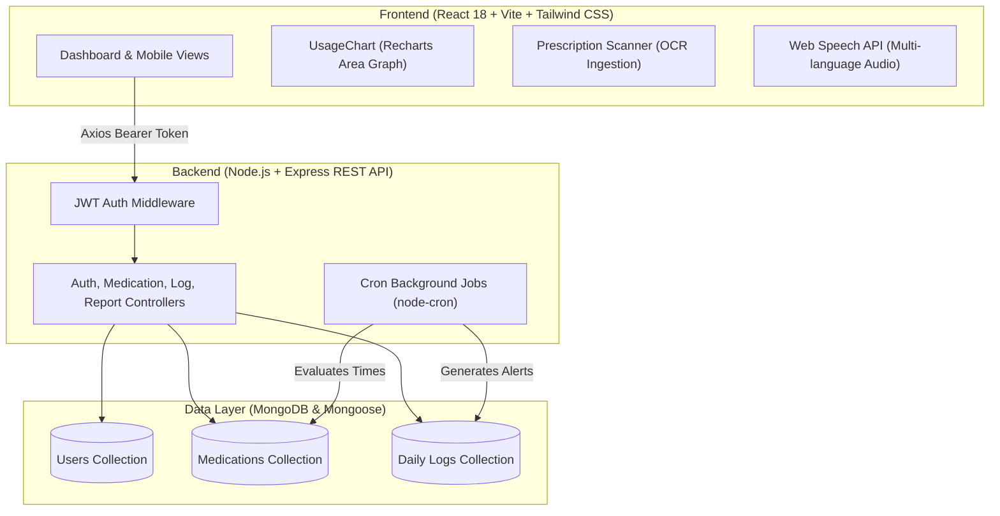

# 🎓 RemindU (DRemindU) — Complete Technical Interview Guide

> **Your 30-Second Elevator Pitch**  
> *"RemindU is a full-stack, mobile-first healthcare companion designed to eliminate medication non-adherence. It combines smart prescription scanning (OCR), multi-language voice and visual cues, automated background cron scheduling, emergency SOS protocols (such as hypoglycemia management), and interactive 7-day adherence analytics. I built it using React 18, Tailwind CSS, Framer Motion, and Recharts on the frontend, powered by a Node.js/Express REST API and MongoDB on the backend."*

---

## 🏗️ 1. High-Level Architecture Overview

---

## 💡 2. The Core Problem & Solution

| Problem | RemindU Solution |
| :--- | :--- |
| **Complex Medication Schedules**: Elderly patients or chronic condition patients (e.g. diabetes) forget multiple daily doses. | **Active Reminders & Next Dose Countdown**: Calculates next imminent dose dynamically down to the minute and provides color-coded time cards. |
| **Language & Accessibility Barriers**: Medical jargon and English-only interfaces alienate diverse populations. | **Multi-Language Support**: English, Hindi, Kannada, Tamil with text-to-speech voice reminders. |
| **Critical Emergencies (e.g. Hypoglycemia)**: Patients panic when blood sugar plummets and don't know the exact protocol. | **One-Tap Emergency SOS**: Built-in "Rule of 15" guide with instant one-tap dialing to the caregiver's emergency contact. |
| **Running Out of Prescriptions**: Patients realize they have no pills left on the day of the dose. | **Inventory & Low-Stock Alerts**: Tracks tablet count decrement on each dose; warns when below threshold. |
| **Prescription Reading Errors**: Reading handwritten doctor prescriptions is difficult. | **Camera & OCR Upload**: Scans prescriptions to auto-fill medication names, frequencies, and dosages. |

---

## 📱 3. Mobile-First UI/UX Engineering Decisions

When asked: *"How did you design for mobile ergonomics?"*

1. **Sticky Ergonomic Header**:
   - Pinned at the top with `backdrop-blur-md` so users never lose access to critical controls.
   - **Emergency SOS** (`🚨`), **Quick Add** (`+ Med`), **Language Selector**, and **Profile** (`👤`) are uniform `38px` touch targets adhering to Apple HIG / Material guidelines.
   - Dynamic label shortening: On small viewports (<640px), buttons display high-contrast, recognizable badges (`SOS`, `Med`, `EN/HI`) to prevent overflow.

2. **2x2 High-Density Stats Grid**:
   - Instead of a long 4-card vertical stack that forces users to scroll endlessly, we implemented a responsive `grid-cols-2 md:grid-cols-4` layout.
   - Users view **Taken**, **Missed**, **Adherence %**, and **Glucose Level** in a single glance above the fold.

3. **Thumb-Friendly Medication Action Cards**:
   - Medication cards feature **color-coded sequential ribbons** (Indigo, Violet, Teal, Rose, Amber).
   - "Take" and "Skip" buttons span full card width with generous vertical padding (`py-2.5`) for reliable thumb tapping without mis-clicks.

---

## 🛠️ 4. Tech Stack & Why Each Tool Was Chosen

### Frontend
- **React 18**: Functional components with hooks (`useState`, `useEffect`, `useMemo`, `useRef`) for reactive UI state.
- **Vite**: Sub-second Hot Module Replacement (HMR) and optimized Rolldown production bundles.
- **Tailwind CSS**: Utility-first CSS ensuring zero unused CSS in production and flexible responsive breakpoints.
- **Framer Motion**: Smooth micro-animations (`layout`, `AnimatePresence`) for card deletion, modal entry, and state transitions.
- **Recharts**: SVG-based declarative charting library used to build the 7-day adherence area chart with custom dark-glass tooltips.

### Backend
- **Node.js + Express**: Event-driven, non-blocking I/O ideal for handling multiple concurrent reminder queries and log dispatches.
- **MongoDB + Mongoose**: Document-based schema perfectly suited for medications with variable dose arrays, times, and dynamic history logs.
- **node-cron**: Background job scheduler running interval checks against the server time to trigger alerts and log missed doses.
- **JWT (JSON Web Tokens)**: Stateless authentication via `Authorization: Bearer <token>` in Axios request interceptors.

---

## 🎯 5. Top 5 Technical Interview Questions & Model Answers

### Q1: *"How does the frontend track whether a medication was already taken today?"*
> **Answer**:
> *"When the dashboard loads, it queries `/logs` for logs matching today's calendar date. We construct an aggregation dictionary (`loggedToday[medId]`) counting how many times each medication was marked taken today. If `loggedToday >= med.dosesPerDay`, the button switches to a disabled, accessible 'Logged' state, preventing duplicate logs while giving the user instant feedback on their daily progress."*

### Q2: *"How do you calculate the 'Next Dose' countdown banner?"*
> **Answer**:
> *"We parse the comma-separated reminder times stored in each medication document (e.g. `'09:00, 21:00'`). We map each time into minutes from midnight, compare against the current system time in minutes, and filter for future doses. We pick the minimum difference to display `'Next Dose In Xh Ym'`. If all today's doses are past, it congratulates the user that all doses are done for the day."*

### Q3: *"How does the Weekly Adherence chart handle missing days or unsorted logs?"*
> **Answer**:
> *"In [`UsageChart.jsx`](file:///c:/Users/fahad/OneDrive/Desktop/RemindU/DRemindU/frontend/src/components/UsageChart.jsx), we fetch activity logs and bucket them by formatted date strings (`toLocaleDateString('short')`). If there are days with no entries, we ensure the data defaults to 0 rather than NaN. We plot two monotone curves: an emerald green area for taken doses and a rose red area for missed doses, with SVG linear gradients fading to opacity 0."*

### Q4: *"Why JWT instead of Session Cookies?"*
> **Answer**:
> *"JWT allows stateless scaling. The server doesn't need to maintain an in-memory session store like Redis for session lookups on every request. The frontend stores the token in `localStorage` and injects it via an Axios interceptor. For production, we can pair this with httpOnly refresh cookies to mitigate XSS risks."*

### Q5: *"What would you improve if given 2 more weeks?"*
> **Answer**:
> 1. *"Implement **Service Worker Web Push Notifications** so reminders trigger even when the browser tab is closed."*
> 2. *"Integrate **Tesseract.js / AWS Textract** directly for high-accuracy client-side prescription OCR extraction."*
> 3. *"Add **Caregiver SMS / WhatsApp webhooks via Twilio** when critical doses are missed 3 times in a row."*
